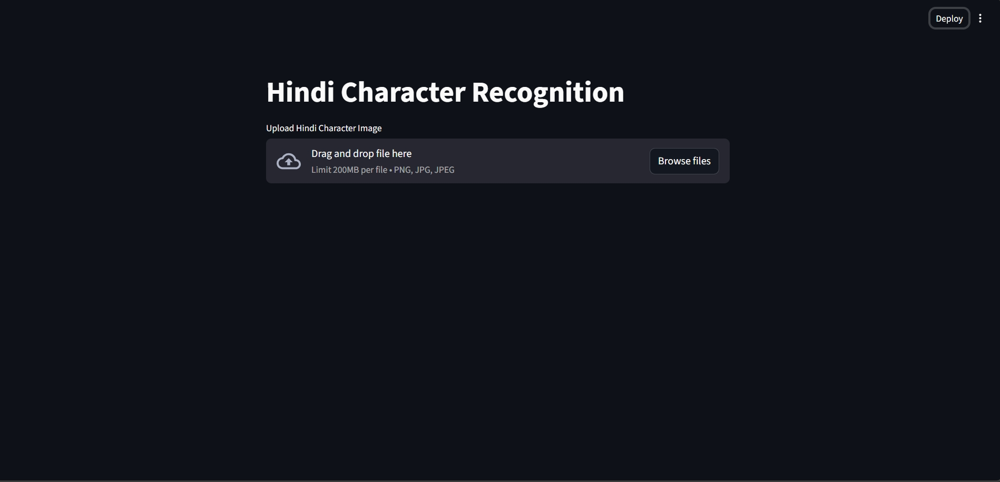
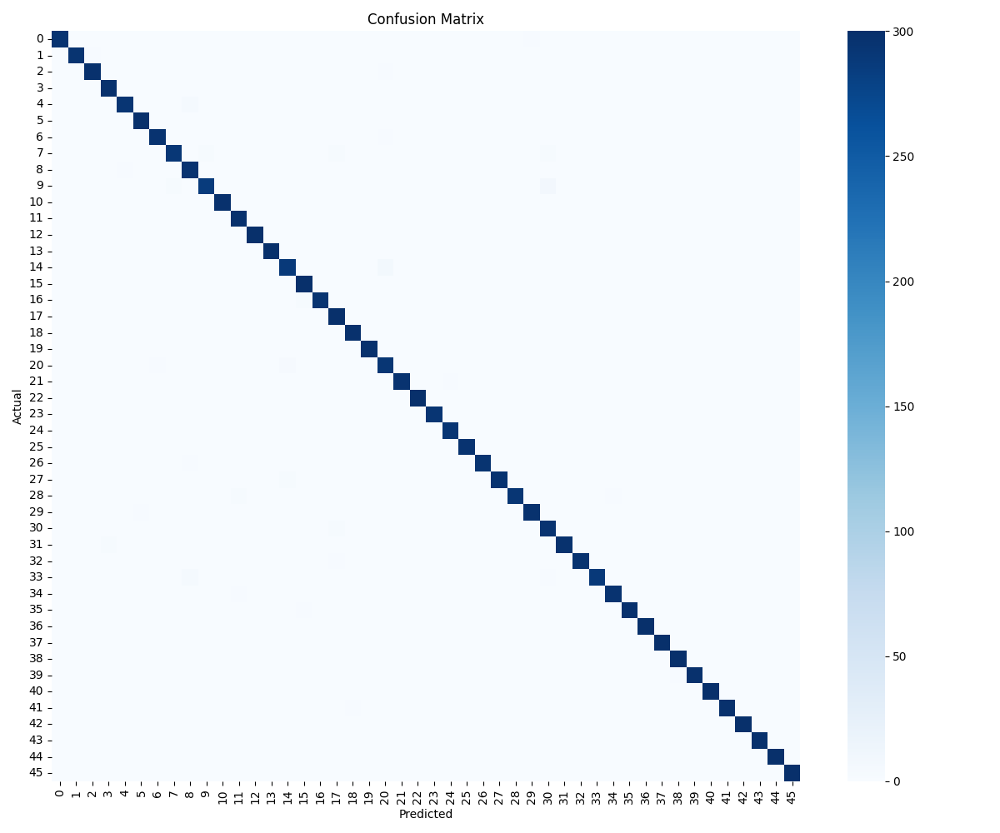
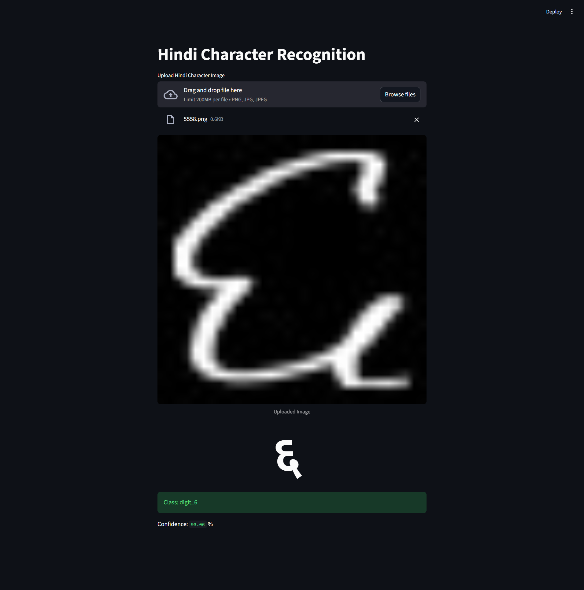

# Hindi Character Recognition using CNN

<p align="center">
  
</p>

Deep learning system for **recognizing handwritten Hindi (Devanagari) characters and digits** using a Convolutional Neural Network (CNN).  
The project includes a **complete machine learning pipeline**: model training, evaluation, API deployment, and an interactive web interface.

---

# Project Overview

This project builds a CNN-based classifier capable of recognizing **46 handwritten Devanagari characters and digits** from images.

The system includes:

- CNN model built using **PyTorch**
- **Training pipeline** for dataset processing
- **Evaluation metrics and confusion matrix**
- **FastAPI backend** for model inference
- **Streamlit UI** for real-time predictions

Users can upload a handwritten character image and receive the predicted Hindi character along with model confidence.

---

# Model Performance

Dataset: **Devanagari Handwritten Character Dataset**

Number of classes: **46**

Test Accuracy:

**98.80%**

### Confusion Matrix

<p align="center">
  
</p>

---

# Demo

### Streamlit Interface

<p align="center">
  
</p>

### Prediction Examples

<p align="center">
  
  
</p>

<p align="center">
  
</p>

---

# Tech Stack

### Programming Language
- Python

### Machine Learning
- PyTorch
- Torchvision

### Backend API
- FastAPI
- Uvicorn

### Frontend
- Streamlit

### Libraries
- Pillow
- Requests
- NumPy
- Matplotlib

---

# System Architecture

```
User Uploads Image
        │
        ▼
Streamlit Web Interface
        │
        ▼
FastAPI Inference API
        │
        ▼
PyTorch CNN Model
        │
        ▼
Predicted Hindi Character
```

---

# Project Structure

```
hindi_character_recognition
│
├── api
│   └── api.py                # FastAPI inference server
│
├── app
│   └── app.py                # Streamlit UI
│
├── data
│   ├── raw                   # Original dataset
│   └── processed             # Processed dataset
│
├── models
│   └── hindi_cnn_best.pth    # Trained model
│
├── results
│   ├── confusion_matrix.png
│   ├── UI.png
│   ├── prediction_example.png
│   ├── prediction_example_2.png
│   └── prediction_example_3.png
│
├── src
│   ├── dataset.py
│   ├── model.py
│   ├── train.py
│   ├── evaluate_model.py
│   └── test_model.py
│
├── requirements.txt
├── README.md
└── .gitignore
```

---

# Installation

Clone the repository

```
git clone https://github.com/Flash6699/Hindi-Character-Recognition-CNN.git
cd Hindi-Character-Recognition-CNN
```

Install dependencies

```
pip install -r requirements.txt
```

---

# Running the Project

### Start FastAPI server

```
uvicorn api.api:app --reload
```

Open API docs:

```
http://127.0.0.1:8000/docs
```

---

### Run Streamlit UI

```
streamlit run app/app.py
```

Upload a handwritten Hindi character image to get predictions.

---

# Example Output

Input: handwritten character image

Output:

```
Predicted Character: क
Confidence: 98.4%
```

---

# Key Features

- CNN-based handwritten Hindi character recognition
- **98.8% model accuracy**
- GPU supported training
- FastAPI model inference API
- Streamlit interactive UI
- Confusion matrix evaluation
- Modular ML pipeline

---

# Future Improvements

- Deploy with **Docker**
- Add **real-time drawing canvas**
- Deploy model on **cloud (AWS / GCP / HuggingFace Spaces)**
- Extend model for **Hindi word recognition**

---

# Author

Vedant

Machine Learning & AI Enthusiast

---

# License

This project is licensed under the **MIT License**.